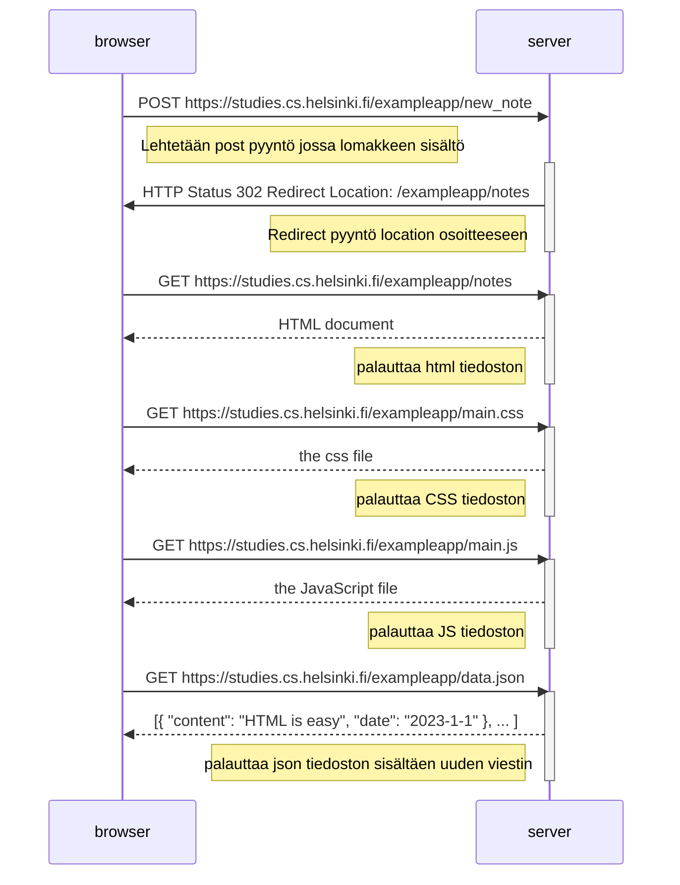

```mermaid
sequenceDiagram
    participant browser
    participant server
    
    browser->>server: POST https://studies.cs.helsinki.fi/exampleapp/new_note
    note right of browser: Lehtetään post pyyntö jossa lomakkeen sisältö
    
    activate server
    
    server->>browser: HTTP Status 302 Redirect Location: /exampleapp/notes
    
    note left of server: Redirect pyyntö location osoitteeseen
    deactivate server

    browser->>server: GET https://studies.cs.helsinki.fi/exampleapp/notes
    activate server
    server-->>browser: HTML document
    note left of server: palauttaa html tiedoston
    deactivate server
    
    browser->>server: GET https://studies.cs.helsinki.fi/exampleapp/main.css
    activate server
    server-->>browser: the css file
    note left of server:palauttaa CSS tiedoston
    deactivate server
    
    browser->>server: GET https://studies.cs.helsinki.fi/exampleapp/main.js
    activate server
    server-->>browser: the JavaScript file
    note left of server: palauttaa JS tiedoston
    deactivate server
    
    browser->>server: GET https://studies.cs.helsinki.fi/exampleapp/data.json
    activate server
    server-->>browser: [{ "content": "HTML is easy", "date": "2023-1-1" }, ... ]
    note left of server: palauttaa json tiedoston sisältäen uuden viestin
    deactivate server    
```