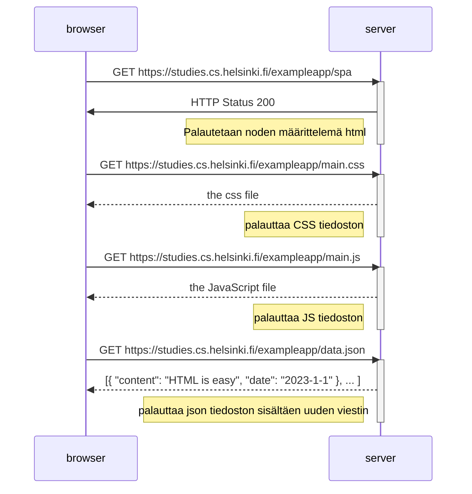

```mermaid
    sequenceDiagram
        participant browser
        participant server
        
        browser->>server: GET https://studies.cs.helsinki.fi/exampleapp/spa
        activate server
        server->>browser: HTTP Status 200
        note left of server: Palautetaan noden määrittelemä html
        deactivate server

        browser->>server: GET https://studies.cs.helsinki.fi/exampleapp/main.css
        activate server
        server-->>browser: the css file
        note left of server:palauttaa CSS tiedoston
        deactivate server
        
        browser->>server: GET https://studies.cs.helsinki.fi/exampleapp/main.js
        activate server
        server-->>browser: the JavaScript file
        note left of server: palauttaa JS tiedoston
        deactivate server
        
        browser->>server: GET https://studies.cs.helsinki.fi/exampleapp/data.json
        activate server
        server-->>browser: [{ "content": "HTML is easy", "date": "2023-1-1" }, ... ]
        note left of server: palauttaa json tiedoston sisältäen uuden viestin
        deactivate server    
```