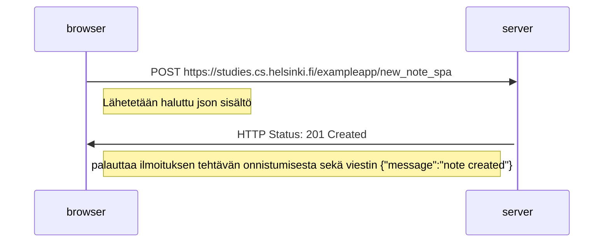

```mermaid
    sequenceDiagram
        participant browser
        participant server
        
        browser->>server: POST https://studies.cs.helsinki.fi/exampleapp/new_note_spa
        note right of browser: Lähetetään haluttu json sisältö

        activate server
        server->>browser: HTTP Status: 201 Created
        note left of server: palauttaa ilmoituksen tehtävän onnistumisesta sekä viestin  {"message":"note created"}
```